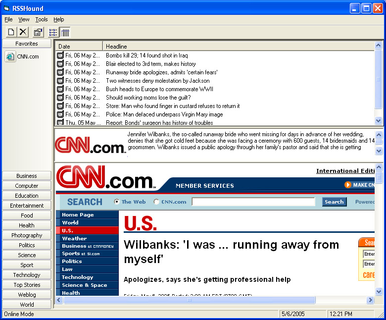



## RssHound \*Updated

### Description

This is a RSS, XML, and ATOM news reader written in VB6.0 that utilizes a MsAccess 2000 db to manage subsriptions and viewed documents. There are more features that will be added in the future. This program also uses MSXML4.0 and the outlookbar posted here on PSC.

*It was pointed out in the first posting of this project that the OBToolbar was not included. This project can be found on PSC but I have included it here with this posting.

** Future version will have all forms for adding, deleteing and editing RSS Entries, the OB Tool bar will be replaced with a treeview for the RSS organization and any other feature that is requested.
 
### More Info
 

             |
---                |---
**Submitted On**   |2005-05-06 12:18:26
**By**             |[Benjamin Bibik](https://github.com/Planet-Source-Code/PSCIndex/blob/master/ByAuthor/benjamin-bibik.md)
**Level**          |Advanced
**User Rating**    |5.0 (10 globes from 2 users)
**Compatibility**  |VB 6\.0
**Category**       |[Complete Applications](https://github.com/Planet-Source-Code/PSCIndex/blob/master/ByCategory/complete-applications__1-27.md)
**World**          |[Visual Basic](https://github.com/Planet-Source-Code/PSCIndex/blob/master/ByWorld/visual-basic.md)
**Archive File**   |[RssHound\_\_188598592005\.zip](https://github.com/Planet-Source-Code/benjamin-bibik-rsshound-updated__1-60394/archive/master.zip)

